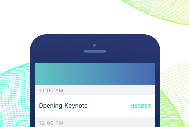
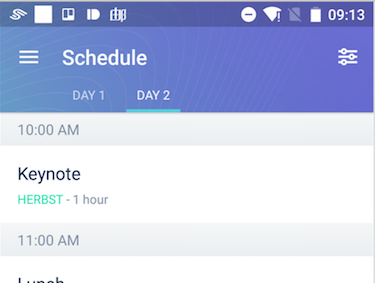
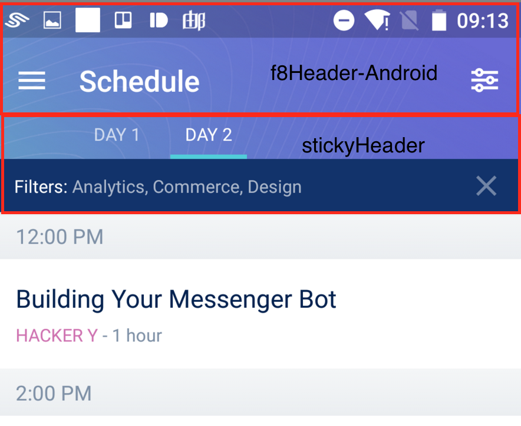
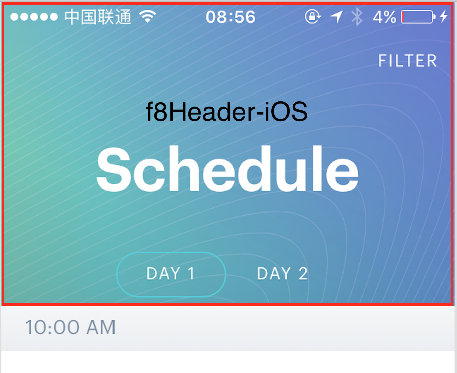
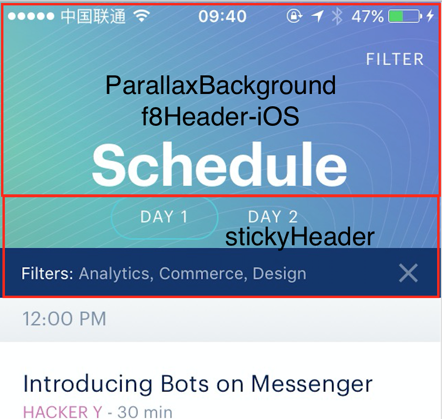

## 2.GeneralScheduleView and ListContainer

> 自定义ViewPager，不同平台的配置

Android:


iOS:


在这个文件里面，再次渲染了一个DrawerLayout，用来装载筛选View。瞅瞅长啥样：

Android:


iOS:


### `GeneralScheduleView`

瞅瞅首屏长啥样：

```javascript
class GeneralScheduleView extends React.Component {
  constructor(props) {
    super(props);
    this.renderEmptyList = this.renderEmptyList.bind(this);
    this.switchDay = this.switchDay.bind(this);
    this.openFilterScreen = this.openFilterScreen.bind(this);
    // 渲染右侧边栏里面的FilterScreen
    this.renderNavigationView = this.renderNavigationView.bind(this);
  }
  
  render() {
    // 顶部ToolBar上右侧的图标和对应函数作为配置传入
    const filterItem = {
      icon: require('../../common/img/filter.png'),
      title: 'Filter',
      onPress: this.openFilterScreen,
    };
    // 通过右侧边栏筛选出的结果UI也会复用这个组件，但是会多出一个粘性的头部，用来展现当前选择的谁
    const filterHeader = Object.keys(this.props.filter).length > 0
      ? <FilterHeader />
      : null;

    const content = (
      // 在一个自定义的ListContainer中，渲染了两个ScheduleListView。通过使用应用我们可以体会到，那个ListContainer应该是封装了两个组件，对应Android平台的ViewPagerAndroid和iOS平台的模拟ViewPagerAndroid
      <ListContainer
        title="Schedule"
        selectedSegment={this.props.day - 1}
        // 用来绑定ViewPager切换时的函数
        onSegmentChange={this.switchDay}
        backgroundImage={require('./img/schedule-background.png')}
        backgroundColor="#5597B8"
        selectedSectionColor="#51CDDA"
        stickyHeader={filterHeader}
        rightItem={filterItem}>
        <ScheduleListView
          title="Day 1"
          day={1}
          sessions={this.props.sessions}
          renderEmptyList={this.renderEmptyList}
          navigator={this.props.navigator}
        />
        <ScheduleListView
          title="Day 2"
          day={2}
          sessions={this.props.sessions}
          renderEmptyList={this.renderEmptyList}
          navigator={this.props.navigator}
        />
      </ListContainer>
    );
    // 注意不同平台不同UI的渲染
    if (Platform.OS === 'ios') {
      return content;
    }
    return (
      // 最后，如果是Android平台的话，就用一个右侧的DrawerLayout包裹content输出。DrawerLayout内渲染的是FilterView
      <F8DrawerLayout
        ref={(drawer) => this._drawer = drawer}
        drawerWidth={300}
        drawerPosition="right"
        renderNavigationView={this.renderNavigationView}>
        {content}
      </F8DrawerLayout>
    );
  }
  
  renderNavigationView() {
    return <FilterScreen onClose={() => this._drawer && this._drawer.closeDrawer()} />;
  }
  renderEmptyList(day: number) {
    return (
      <EmptySchedule
        title={`No sessions on day ${day} match the filter`}
        text="Check the schedule for the other day or remove the filter."
      />
    );
  }
}
```

所以在这个首屏里，Android平台会渲染一个被右侧划出的DrawerLayout（内部渲染FilterView）包裹的自定义ViewPager，iOS平台则会直接渲染一个自定义ViewPager。

F8DrawerLayout的代码比较简单，[之前也分析过](./0.Common Component.md)，主要作用是注册后退按键监听事件，以便在openDrawer之后，按下后退键触发的是closeDrawer事件。接下来着重分析一下ListContainer

### `ListContainer`

```javascript
class ListContainer extends React.Component {
  constructor(props: Props) {
    super(props);

    this.state = ({
      // props.selectedSegment其实是父组件的props.day - 1，也就是当前选择的tab的index
      idx: this.props.selectedSegment || 0,
      anim: new Animated.Value(0),
      stickyHeaderHeight: 0,
    }: State);

    this.renderFakeHeader = this.renderFakeHeader.bind(this);
    this.handleStickyHeaderLayout = this.handleStickyHeaderLayout.bind(this);
    this.handleShowMenu = this.handleShowMenu.bind(this);
    this.handleSelectSegment = this.handleSelectSegment.bind(this);
    this._refs = [];
  }
  
  render() {
    // topbar上左侧的图标会根据是否有消息而渲染不同的图标
    var leftItem = this.props.leftItem;
    if (!leftItem && Platform.OS === 'android') {
      leftItem = {
        title: 'Menu',
        icon: this.context.hasUnreadNotifications
          ? require('./img/hamburger-unread.png')
          : require('./img/hamburger.png'),
        onPress: this.handleShowMenu,
      };
    }
    
    const segments = [];
    const content = React.Children.map(this.props.children, (child, idx) => {
      segments.push(child.props.title);
      return <RelayLoading>{React.cloneElement(child, {
        // ...忽略
        // 将每个ListContainer中的Child都用RelayLoading封装了起来
      })}</RelayLoading>;
    });
    // 这个地方通过F8SegmentedControl渲染了头部的那个选项表，而且根据其父组件的传值，在有filter的时候，this.props.stickyHeader=<FilterHeader />，<FilterHeader />会包装在F8SegmentedControl底部，达到粘停在顶部的视觉效果
    let {stickyHeader} = this.props;
    if (segments.length > 1) {
      stickyHeader = (
        <View>
          <F8SegmentedControl
            values={segments}
            selectedIndex={this.state.idx}
            selectionColor={this.props.selectedSectionColor}
            onChange={this.handleSelectSegment}
          />
          {stickyHeader}
        </View>
      );
    }
    // backgroundShift = currentIndex / maxIndex
    const backgroundShift = segments.length === 1
      ? 0
      : this.state.idx / (segments.length - 1);
    return (
      <View style={styles.container}>
        <View style={styles.headerWrapper}>
          // ParallaxBackground用来展现当tab切换时背景图片转换的动效
          // 将初始化的Animated作为参数传入
          <ParallaxBackground
            minHeight={this.state.stickyHeaderHeight + F8Header.height}
            maxHeight={EMPTY_CELL_HEIGHT + this.state.stickyHeaderHeight + F8Header.height}
            offset={this.state.anim}
            // 头部背景图的切换是根据backgroundShift来转换其shift，详见ParallaxBackground的解析
            backgroundImage={this.props.backgroundImage}
            backgroundShift={backgroundShift}
            backgroundColor={this.props.backgroundColor}>
            // renderParallaxContent渲染iOS平台上列表头部的大标题
            {this.renderParallaxContent()}
          </ParallaxBackground>
          // F8Header渲染头部，对于Android平台会使用ToobarAndroid组件，iOS则自定义
          // leftItem和rightItem分别对应头部左右两侧的icon及其绑定的函数
          <F8Header
            title={this.props.title}
            leftItem={leftItem}
            rightItem={this.props.rightItem}
            extraItems={this.props.extraItems}>
            // 在iOS平台上，向上滑动列表会使得原本头部的大标题逐渐消失，出现一个小一号的标题。renderHeaderTitle就是为此而针对iOS平台渲染了一个<Animated.Text/>作为会逐渐显示的小标题
            {this.renderHeaderTitle()}
          </F8Header>
          {this.renderFixedStickyHeader(stickyHeader)}
        </View>
        <ViewPager
          count={segments.length}
          selectedIndex={this.state.idx}
          onSelectedIndexChange={this.handleSelectSegment}>
          {content}
        </ViewPager>
        {this.renderFloatingStickyHeader(stickyHeader)}
      </View>
    );
  }
}
```

可以看见f8的头部组成大致上是这样的：

```javascript
<View style={styles.headerWrapper}>
  <ParallaxBackground
    minHeight={this.state.stickyHeaderHeight + F8Header.height}
    maxHeight={EMPTY_CELL_HEIGHT + this.state.stickyHeaderHeight + F8Header.height}
    offset={this.state.anim}
    backgroundImage={this.props.backgroundImage}
    backgroundShift={backgroundShift}
    backgroundColor={this.props.backgroundColor}>
    {this.renderParallaxContent()}
  </ParallaxBackground>
  <F8Header
    title={this.props.title}
    leftItem={leftItem}
    rightItem={this.props.rightItem}
    extraItems={this.props.extraItems}>
    {this.renderHeaderTitle()}
  </F8Header>
  {this.renderFixedStickyHeader(stickyHeader)}
</View>
```

`ParallaxBackground`是absolute布局，定位在顶部。它接受背景图片和偏移量作为参数。在其内部，将背景图加载在`<Animated.Image/>`上，并给予其`style={transforms = { transform: [{translateX}, {translateY}, {scale}] }}`，transform的数值由偏移量计算得来。因此，当左右切换tab的时候，就会有背景图片的改变动效。

此外，iOS端上列表顶部的大号标题也是在`ParallaxBackground`内，通过`renderParallaxContent()`渲染出来的

`ParallaxBackground`的实际样式：


而`F8Header`则保持透明，覆盖在`ParallaxBackground`上。在紧接着`F8Header`的后面（视觉层面在F8Header的下方），通过`renderFixedStickyHeader(stickyHeader)`方法，根据不同平台渲染了Android的stickyHeader



对于Android平台，f8Header下方的tab和filter部分都是stickyHeader：



对于iOS平台，则特别通过`renderHeaderTitle()`渲染了一个`<Animated.Text/>`，使得上拉列表隐藏大标题时会展现一个小一号的标题



而它的stickyHeader，则是在`<ViewPager/>`后面，通过`renderFloatingStickyHeader(stickyHeader)`方法渲染了一个类似的stickyHeader

