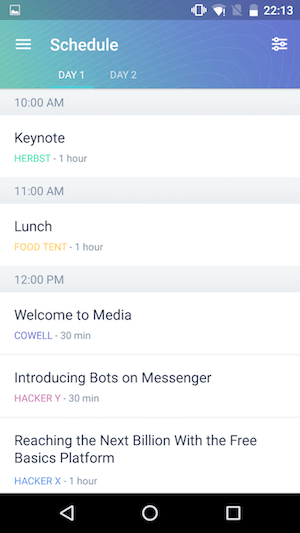
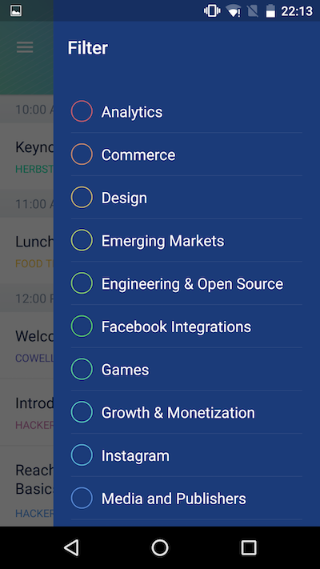

## 2.GeneralScheduleView

瞅瞅首屏长啥样：


在这个文件里面，再次渲染了一个DrawerLayout，用来选择筛选。瞅瞅长啥样：


```javascript
class GeneralScheduleView extends React.Component {
  constructor(props) {
    super(props);
    this.renderEmptyList = this.renderEmptyList.bind(this);
    this.switchDay = this.switchDay.bind(this);
    this.openFilterScreen = this.openFilterScreen.bind(this);
    // 渲染右侧边栏里面的FilterScreen
    this.renderNavigationView = this.renderNavigationView.bind(this);
  }
  
  render() {
    const filterItem = {
      icon: require('../../common/img/filter.png'),
      title: 'Filter',
      onPress: this.openFilterScreen,
    };

    const filterHeader = Object.keys(this.props.filter).length > 0
      ? <FilterHeader />
      : null;

    const content = (
      <ListContainer
        title="Schedule"
        selectedSegment={this.props.day - 1}
        onSegmentChange={this.switchDay}
        backgroundImage={require('./img/schedule-background.png')}
        backgroundColor="#5597B8"
        selectedSectionColor="#51CDDA"
        stickyHeader={filterHeader}
        rightItem={filterItem}>
        <ScheduleListView
          title="Day 1"
          day={1}
          sessions={this.props.sessions}
          renderEmptyList={this.renderEmptyList}
          navigator={this.props.navigator}
        />
        <ScheduleListView
          title="Day 2"
          day={2}
          sessions={this.props.sessions}
          renderEmptyList={this.renderEmptyList}
          navigator={this.props.navigator}
        />
      </ListContainer>
    );
    // 注意不同平台不同UI的渲染
    if (Platform.OS === 'ios') {
      return content;
    }
    return (
      <F8DrawerLayout
        ref={(drawer) => this._drawer = drawer}
        drawerWidth={300}
        drawerPosition="right"
        renderNavigationView={this.renderNavigationView}>
        {content}
      </F8DrawerLayout>
    );
  }
}
```