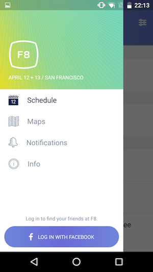

## 2. Navigator and Basic Framework

相对于上一节，这一节将会更加细致的分析其代码，跟着F8源码走一步步探究它的组件和实现思路

### `F8App.js`

```javascript
render: function() {
  if (!this.props.isLoggedIn) {
    return <LoginScreen />;
  }
  return (
    <View style={styles.container}>
      <StatusBar
        translucent={true}
        backgroundColor="rgba(0, 0, 0, 0.2)"
        barStyle="light-content"
       />
      <F8Navigator />
      <PushNotificationsController />
    </View>
  );
},
```

easy to understand.

### `login/LoginScreen.js`


在它的源码里面我们可以学到神奇的[`Animated`](https://facebook.github.io/react-native/docs/animated.html)用法：

通过使用`Animated`内置组件（`Animated.View`、`Animated.Image`、`Animated.Text`），我们可以在其加载渲染之后，通过`Animated.timing`来挂载其动画效果：

```javascript
componentDidMount() {
     Animated.timing(          // 运动类型，有 spring, decay, timing 三种
       startValue,             // 起始值，类型为 Animated.Value
       {toValue: 1}            // Configuration
     ).start();                // Don't forget start!
}
```

```javascript
<Animated.Image
	source={require('./img/x.png')}
/>
<Animated.Text style={}>
	This is Animated Text
</Animated.Text>
```

需要注意的是，`startValue`必须是`Animated.Value`类型的值，可以通过`new Animated.Value(initNumber)`来创建。

给一个官方栗子：

```javascript
class Playground extends React.Component {
  constructor(props) {
    super(props);
    this.state = {
      bounceValue: new Animated.Value(0),
    };
  }
  render() {
    return (
      <Animated.Image                         // Base: Image, Text, View
        source={{uri: 'http://i.imgur.com/XMKOH81.jpg'}}
        style={{
          flex: 1,
          transform: [                        // `transform` is an ordered array
            {scale: this.state.bounceValue},  // Map `bounceValue` to `scale`
          ]
        }}
      />
    );
  }
  componentDidMount() {
    this.state.bounceValue.setValue(1.5);     // Start large
    Animated.spring(                          // Base: spring, decay, timing
      this.state.bounceValue,                 // Animate `bounceValue`
      {
        toValue: 0.8,                         // Animate to smaller size
        friction: 1,                          // Bouncier spring
      }
    ).start();                                // Start the animation
  }
}
```

### `F8Navigator.js`

#### Preview

```javascript
var F8Navigator = React.createClass({
  // 类型为 Array，储存注册的后退事件监听处理函数
  _handlers: ([]: Array<() => boolean>),

  // 在 didMount 的时候，通过 BackAndroid API 注册了后退按键按下时的处理事件，而在 willUnmount 的时候，则取消注册
  componentDidMount: function() {
    BackAndroid.addEventListener('hardwareBackPress', this.handleBackButton);
  },
  componentWillUnmount: function() {
    BackAndroid.removeEventListener('hardwareBackPress', this.handleBackButton);
  },

  // 通过 getChildContext 指定的 context 元素可以被子组件引用，但是子组件是需要通过 contextTypes 来指定所需要的 context 元素的
  // 将 BackButtonListener 放入 context，child 可以通过 constructor(props, context) 继承并使用它们
  // 比如，在下文的 F8DrawerLayout 组件中，通过 context 获取到了BackButtonListener。因此，当 DrawerLayout open 时，调用 addBackButtonListener 新注册一个后退事件，close 时通过 removeBackButtonListener 取消注册，使得在 open 时按下后退键，触发的是新注册的事件函数。这样就可以达到通过后退按键 close drawer 的效果
  getChildContext() {
    return {
      addBackButtonListener: this.addBackButtonListener,
      removeBackButtonListener: this.removeBackButtonListener,
    };
  },
  addBackButtonListener: function(listener) {
    this._handlers.push(listener);
  },
  removeBackButtonListener: function(listener) {
    this._handlers = this._handlers.filter((handler) => handler !== listener);
  },

  // 注册的后退按键监听按下处理函数，接下来再分析
  handleBackButton: function() {},
  
  render: function() {
    return (
      <Navigator
        ref="navigator"
        style={styles.container}
        configureScene={(route) => {
          // 通过分辨平台/场景来定义不同的转场动效
          if (Platform.OS === 'android') {
            return Navigator.SceneConfigs.FloatFromBottomAndroid;
          }
          if (route.shareSettings || route.friend) {
            return Navigator.SceneConfigs.FloatFromRight;
          } else {
            return Navigator.SceneConfigs.FloatFromBottom;
          }
        }}
        initialRoute={{}}
        // 一个超大的路由判断函数，渲染不同 component
        renderScene={this.renderScene}
      />
    );
  },
  
  renderScene: function(route, navigator) {
    // 省略很多路由判断...
    if (route.login) {
      return (
        <LoginModal
          navigator={navigator}
          onLogin={route.callback}
        />
      );
    }
    // 省略很多路由判断...
    // 初始化时渲染的component
    return <F8TabsView navigator={navigator} />;
  }
});

F8Navigator.childContextTypes = {
  addBackButtonListener: React.PropTypes.func,
  removeBackButtonListener: React.PropTypes.func,
};
```

#### `handleBackButton`

> 按下后退按键时的处理函数

```javascript
handleBackButton: function() {
  // 对所有注册的函数依次进行调用
  for (let i = this._handlers.length - 1; i >= 0; i--) {
    if (this._handlers[i]()) {
      return true;
    }
  }
  // 如果当前不是最后一个路由，则将当前路由出栈
  const {navigator} = this.refs;
  if (navigator && navigator.getCurrentRoutes().length > 1) {
    navigator.pop();
    return true;
  }
  // 并确保回退以后回到默认页面
  if (this.props.tab !== 'schedule') {
    this.props.dispatch(switchTab('schedule'));
    return true;
  }
  return false;
},
```

### `tabs/F8TabsView.js`

#### `F8TabsView.android.js`


```javascript
class F8TabsView extends React.Component {
  constructor(props) {
    super(props);
    // 侧边栏的渲染函数
    this.renderNavigationView = this.renderNavigationView.bind(this);
    // 添加在侧边栏渲染函数里渲染出来的组件上
    this.openProfileSettings = this.openProfileSettings.bind(this);
    this.openDrawer = this.openDrawer.bind(this);
  }
  
  getChildContext() {
    return {
      openDrawer: this.openDrawer,
      hasUnreadNotifications: this.props.notificationsBadge > 0,
    };
  }
  // 根据不同登录状态渲染侧边栏
  renderNavigationView() {
    if (this.props.user.isLoggedIn) {
      accountItem = (
        <View>
          <TouchableOpacity onPress={this.openProfileSettings}>
            <ProfilePicture userID={this.props.user.id} size={80} />
          </TouchableOpacity>
          <Text style={styles.name}>
            {name.toUpperCase()}
          </Text>
        </View>
      );
    }else {
      accountItem = (...// 忽略)
    }
    return (...)
  }
  // 渲染不同内容
  renderContent() {
    switch (this.props.tab) {
      case 'schedule':
        return (
          // 首屏
          <GeneralScheduleView
            navigator={this.props.navigator}
          />
        );
      ... // 忽略
    }
  }
  
  render() {
    return (
      // 在登录之后，以F8DrawerLayout作为外层组件布局，之后根据选择的 menu(this.props.tab) 不同，来选择性渲染不同的 content
      <F8DrawerLayout
        ref="drawer"
        drawerWidth={290}
        drawerPosition="left"
        renderNavigationView={this.renderNavigationView}>
        <View style={styles.content} key={this.props.tab}>
          // 根据state中的tab渲染不同内容
          {this.renderContent()}
        </View>
      </F8DrawerLayout>
    )
  }
}
```

#### `F8TabsView.ios.js`


iOS 和 Android 主要不同的一点是，Android 会渲染一个`DrawerLayout`，之后根据所选的`tab`，来渲染不同组件；而 iOS 则是通过`TabBarIOS`组件，其中会加载多个`TabBarItemIOS`作为底部的`tab`，每个`tab`除了定义`title`、`onPress`、`selected`等事件和状态外，还会在包裹对应的`content`组件在内部。

```javascript
class F8TabsView extends React.Component {
  render() {
    return (
      <TabBarIOS>
        <TabBarItemIOS
          title="Schedule"
          selected={this.props.tab === 'schedule'}
          onPress={this.onTabSelect.bind(this, 'schedule')}
          icon={scheduleIcon}
          selectedIcon={scheduleIconSelected}>
          <GeneralScheduleView
            navigator={this.props.navigator}
          />
        </TabBarItemIOS>
      </TabBarIOS>
    )
  }
}
```

### `common/F8DrawerLayout.js`

> Android 下`F8TabsView.android.js`内使用的组件



```javascript
class F8DrawerLayout extends React.Component {
  constructor(props: any, context: any) {
    super(props, context);

    this.openDrawer = this.openDrawer.bind(this);
    this.closeDrawer = this.closeDrawer.bind(this);
    this.onDrawerOpen = this.onDrawerOpen.bind(this);
    this.onDrawerClose = this.onDrawerClose.bind(this);
    this.handleBackButton = this.handleBackButton.bind(this);
  }
  // 打开侧边栏的时候，通过context注册后退按键监听事件
  onDrawerOpen() {
    this.context.addBackButtonListener(this.handleBackButton);
    this.props.onDrawerOpen && this.props.onDrawerOpen();
  }
  // 关闭/unmount时取消注册
  onDrawerClose() {
    this.context.removeBackButtonListener(this.handleBackButton);
    this.props.onDrawerClose && this.props.onDrawerClose();
  }
  componentWillUnmount() {
    this.context.removeBackButtonListener(this.closeDrawer);
    this._drawer = null;
  }
  // 处理后退按键
  handleBackButton(): boolean {
    this.closeDrawer();
    return true;
  }
  closeDrawer() {
    this._drawer && this._drawer.closeDrawer();
  }
  openDrawer() {
    this._drawer && this._drawer.openDrawer();
  }
}

F8DrawerLayout.contextTypes = {
  addBackButtonListener: React.PropTypes.func,
  removeBackButtonListener: React.PropTypes.func,
};

module.exports = F8DrawerLayout;
```