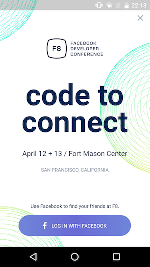

## 2. Navigator and Basic Framework

跟着F8源码走一步步探究它的组件和实现思路

### `F8App.js`

```javascript
render: function() {
  if (!this.props.isLoggedIn) {
    return <LoginScreen />;
  }
  return (
    <View style={styles.container}>
      <StatusBar
        translucent={true}
        backgroundColor="rgba(0, 0, 0, 0.2)"
        barStyle="light-content"
       />
      <F8Navigator />
      <PushNotificationsController />
    </View>
  );
},
```
easy to understand.

### `login/LoginScreen.js`



在它的源码里面我们可以学到神奇的[`Animated`](https://facebook.github.io/react-native/docs/animated.html)用法

```javascript
var Animated = require('Animated');
var Dimensions = require('Dimensions');

class LoginScreen extends React.Component {
  constructor(props) {
    super(props);
    this.state = {
      // create an Animated.Value, hook it up to one or more style attributes of an animated component
      anim: new Animated.Value(0),
    };
  }

  componentDidMount() {
    StatusBarIOS && StatusBarIOS.setStyle('default');
    // then drive updates via animations, such as Animated.timing,
    Animated.timing( // Uses easing functions
      this.state.anim,  // The value to drive
      {toValue: 3000, duration: 3000} // Configuration
    ).start();
  }

  render() {
    return (
      <Image
        style={styles.container}
        source={require('./img/login-background.png')}>
        <TouchableOpacity
          accessibilityLabel="Skip login"
          accessibilityTraits="button"
          style={styles.skip}
          onPress={() => this.props.dispatch(skipLogin())}>
          <Animated.Image
            style={this.fadeIn(2800)} // use the fadeIn animation in the following fun
            source={require('./img/x.png')}
          />
        </TouchableOpacity>
        <View style={styles.section}>
          <Animated.Image
            style={this.fadeIn(0)}
            source={require('./img/devconf-logo.png')}
          />
        </View>
        <View style={styles.section}>
          <Animated.Text style={[styles.h1, this.fadeIn(700, -20)]}>
            code to
          </Animated.Text>
          // 省略部分代码..
        </View>
        <Animated.View style={[styles.section, styles.last, this.fadeIn(2500, 20)]}>
          <Text style={styles.loginComment}>
            Use Facebook to find your friends at F8.
          </Text>
          <LoginButton source="First screen" />
        </Animated.View>
      </Image>
    );
  }

  fadeIn(delay, from = 0) {
    const {anim} = this.state;
    return {
      opacity: anim.interpolate({
        inputRange: [delay, Math.min(delay + 500, 3000)],
        outputRange: [0, 1],
        extrapolate: 'clamp',
      }),
      transform: [{
        translateY: anim.interpolate({
          inputRange: [delay, Math.min(delay + 500, 3000)],
          outputRange: [from, 0],
          extrapolate: 'clamp',
        }),
      }],
    };
  }
}
```

### `F8Navigator.js`

#### Preview

```javascript
var F8Navigator = React.createClass({
  _handlers: ([]: Array<() => boolean>),
  // 在DidMount的时候，通过BackAndroid API注册了后退按键按下时的处理事件，而在WillUnmount的时候，则取消注册
  componentDidMount: function() {
    BackAndroid.addEventListener('hardwareBackPress', this.handleBackButton);
  },
  componentWillUnmount: function() {
    BackAndroid.removeEventListener('hardwareBackPress', this.handleBackButton);
  },
  // 通过 getChildContext 指定的context元素可以被子组件引用，但是子组件是需要通过 contextTypes 来指定所需要的context元素的
  // 将BackButtonListener放入context，child可以通过constructor(props, context)继承并使用它们
  // 比如，在下文的F8DrawerLayout组件中，通过context获取到了BackButtonListener。因此，当DrawerLayout open时，调用addBackButtonListener新注册一个后退事件，close时通过removeBackButtonListener取消注册，使得在open时按下后退键，触发的是新注册的事件函数。这样就可以达到通过后退按键close drawer的效果
  getChildContext() {
    return {
      addBackButtonListener: this.addBackButtonListener,
      removeBackButtonListener: this.removeBackButtonListener,
    };
  },
  
  addBackButtonListener: function(listener) {
    this._handlers.push(listener);
  },
  removeBackButtonListener: function(listener) {
    this._handlers = this._handlers.filter((handler) => handler !== listener);
  },
  // 注册的后退按键监听按下处理函数，接下来再分析
  handleBackButton: function() {},
  
  render: function() {
    return (
      <Navigator
        ref="navigator"
        style={styles.container}
        configureScene={(route) => {
          // 通过分辨平台/场景来定义不同的转场动效
          if (Platform.OS === 'android') {
            return Navigator.SceneConfigs.FloatFromBottomAndroid;
          }
          if (route.shareSettings || route.friend) {
            return Navigator.SceneConfigs.FloatFromRight;
          } else {
            return Navigator.SceneConfigs.FloatFromBottom;
          }
        }}
        initialRoute={{}}
        // 一个超大的路由判断函数，渲染不同component
        renderScene={this.renderScene}
      />
    );
  },
  
  renderScene: function(route, navigator) {
    // 省略很多路由判断...
    if (route.login) {
      return (
        <LoginModal
          navigator={navigator}
          onLogin={route.callback}
        />
      );
    }
    // 省略很多路由判断...
    // 初始化时渲染的component
    return <F8TabsView navigator={navigator} />;
  }
});

F8Navigator.childContextTypes = {
  addBackButtonListener: React.PropTypes.func,
  removeBackButtonListener: React.PropTypes.func,
};
```

#### `handleBackButton`

```javascript
handleBackButton: function() {
  for (let i = this._handlers.length - 1; i >= 0; i--) {
    if (this._handlers[i]()) {
      return true;
    }
  }
  
  const {navigator} = this.refs;
  if (navigator && navigator.getCurrentRoutes().length > 1) {
    navigator.pop();
    return true;
  }
  
  if (this.props.tab !== 'schedule') {
    this.props.dispatch(switchTab('schedule'));
    return true;
  }
  return false;
},
```

### `tabs/F8TabsView.js`


```javascript
class F8TabsView extends React.Component {
  constructor(props) {
    super(props);
    // 侧边栏的渲染函数
    this.renderNavigationView = this.renderNavigationView.bind(this);
    // 添加在侧边栏渲染函数里渲染出来的组件上
    this.openProfileSettings = this.openProfileSettings.bind(this);
    this.openDrawer = this.openDrawer.bind(this);
  }
  
  getChildContext() {
    return {
      openDrawer: this.openDrawer,
      hasUnreadNotifications: this.props.notificationsBadge > 0,
    };
  }
  // 根据不同登录状态渲染侧边栏
  renderNavigationView() {
    if (this.props.user.isLoggedIn) {
      accountItem = (
        <View>
          <TouchableOpacity onPress={this.openProfileSettings}>
            <ProfilePicture userID={this.props.user.id} size={80} />
          </TouchableOpacity>
          <Text style={styles.name}>
            {name.toUpperCase()}
          </Text>
        </View>
      );
    }else {
      accountItem = (...// 忽略)
    }
    return (...)
  }
  // 渲染不同内容
  renderContent() {
    switch (this.props.tab) {
      case 'schedule':
        return (
          // 首屏
          <GeneralScheduleView
            navigator={this.props.navigator}
          />
        );
      ... // 忽略
    }
  }
  
  render() {
    return (
      // 在登录之后，以F8DrawerLayout作为外层组件布局，根据不同状态渲染侧边栏
      <F8DrawerLayout
        ref="drawer"
        drawerWidth={290}
        drawerPosition="left"
        renderNavigationView={this.renderNavigationView}>
        <View style={styles.content} key={this.props.tab}>
          // 根据state中的tab渲染不同内容
          {this.renderContent()}
        </View>
      </F8DrawerLayout>
    )
  }
}
```

### `common/F8DrawerLayout.js`

来瞅瞅这个贯穿f8外层组件的DrawerLayout长什么样


```javascript
class F8DrawerLayout extends React.Component {
  constructor(props: any, context: any) {
    super(props, context);

    this.openDrawer = this.openDrawer.bind(this);
    this.closeDrawer = this.closeDrawer.bind(this);
    this.onDrawerOpen = this.onDrawerOpen.bind(this);
    this.onDrawerClose = this.onDrawerClose.bind(this);
    this.handleBackButton = this.handleBackButton.bind(this);
  }
  // 打开侧边栏的时候，通过context注册后退按键监听事件
  onDrawerOpen() {
    this.context.addBackButtonListener(this.handleBackButton);
    this.props.onDrawerOpen && this.props.onDrawerOpen();
  }
  // 关闭/unmount时取消注册
  onDrawerClose() {
    this.context.removeBackButtonListener(this.handleBackButton);
    this.props.onDrawerClose && this.props.onDrawerClose();
  }
  componentWillUnmount() {
    this.context.removeBackButtonListener(this.closeDrawer);
    this._drawer = null;
  }
  // 处理后退按键
  handleBackButton(): boolean {
    this.closeDrawer();
    return true;
  }
  closeDrawer() {
    this._drawer && this._drawer.closeDrawer();
  }
  openDrawer() {
    this._drawer && this._drawer.openDrawer();
  }
}

F8DrawerLayout.contextTypes = {
  addBackButtonListener: React.PropTypes.func,
  removeBackButtonListener: React.PropTypes.func,
};

module.exports = F8DrawerLayout;
```